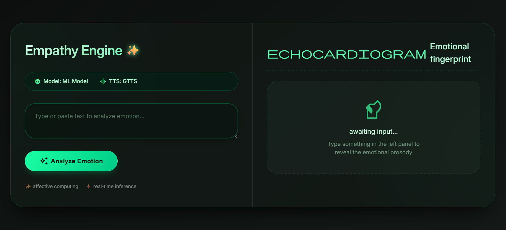
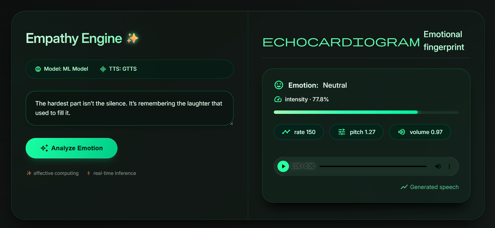

# Empathy Engine (Emotion Analyzer)

A Python-based AI service that detects the **emotion in text** and generates **emotionally expressive speech** by dynamically adjusting voice parameters such as pitch, speed, and volume.

This project was built for the **Empathy Engine Challenge**, which aims to bridge the gap between textual sentiment and human-like speech output.

---

## Overview

Traditional text-to-speech systems produce robotic and monotonic audio.
The goal of this project is to make AI-generated speech sound **more human and expressive** by:

1. Detecting the emotion present in text
2. Mapping that emotion to voice characteristics
3. Generating speech with modified vocal parameters

Example:

| Text                        | Detected Emotion | Voice Behaviour             |
| --------------------------- | ---------------- | --------------------------- |
| "This is amazing news!"     | Happy            | Faster rate, higher pitch   |
| "I am really disappointed." | Sad              | Slower rate, lower pitch    |
| "Why is this not working?"  | Frustrated       | Higher volume, sharper tone |

---

## Features

* Emotion detection using a **pretrained NLP model**
* Dynamic adjustment of speech parameters:

  * Rate (speed)
  * Pitch
  * Volume
* Audio generation using a **Text-to-Speech engine**
* Simple **web interface** built with FastAPI
* Real-time analysis and audio playback
* Visual display of emotion confidence

---

## Tech Stack

* **Python**
* **FastAPI** – API and web backend
* **Hugging Face Transformers** – emotion detection model
* **pyttsx3 / gTTS** – speech synthesis
* **HTML + CSS** – web interface
* **Jinja2 templates** – dynamic UI rendering

---

## Project Structure

```
empathy-engine/
│
├── main.py              # FastAPI backend
├── templates/
│   └── index.html       # Web UI
│
├── static/
│   └── audio/           # Generated speech files
│
├── requirements.txt
└── README.md
```

---

## How It Works

### 1. Text Input

The user enters text in the web interface.

### 2. Emotion Detection

The text is processed using a **pretrained emotion classification model**.

Example output:

```
Emotion: Happy
Confidence: 82%
```

### 3. Emotion-to-Voice Mapping

Each emotion modifies speech parameters.

Example mapping:

| Emotion | Rate | Pitch | Volume |
| ------- | ---- | ----- | ------ |
| Happy   | 1.2  | 1.3   | 1.0    |
| Sad     | 0.8  | 0.7   | 0.9    |
| Angry   | 1.1  | 1.2   | 1.3    |
| Neutral | 1.0  | 1.0   | 1.0    |

### 4. Audio Generation

The system synthesizes speech using the adjusted parameters and returns a **playable audio file**.

---

## Installation

### 1. Clone the repository

```
git clone https://github.com/YOUR_USERNAME/empathy-engine.git
cd empathy-engine
```

### 2. Create virtual environment

```
python -m venv venv
```

Activate it:

Windows

```
venv\Scripts\activate
```

Mac/Linux

```
source venv/bin/activate
```

### 3. Install dependencies

```
pip install -r requirements.txt
```

---

## Running the Application

Start the server:

```
uvicorn main:app --reload
```

Open in browser:

```
http://127.0.0.1:8000
```

---
## Application Screenshots

### Main Interface


### Emotion Detection Result

---

## Example Workflow

1. Enter text in the input field
2. Click **Analyze Text**
3. System detects emotion
4. Speech is generated with appropriate tone
5. Play the generated audio

---

## Possible Improvements

Future enhancements could include:

* More granular emotions (surprise, curiosity, concern)
* Emotion intensity scaling
* SSML support for fine speech control
* Multiple voice options
* Real-time streaming audio

---